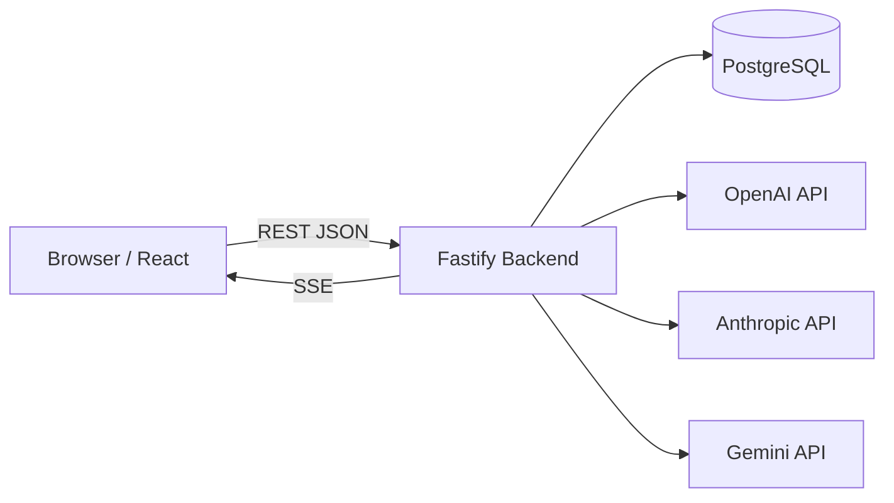
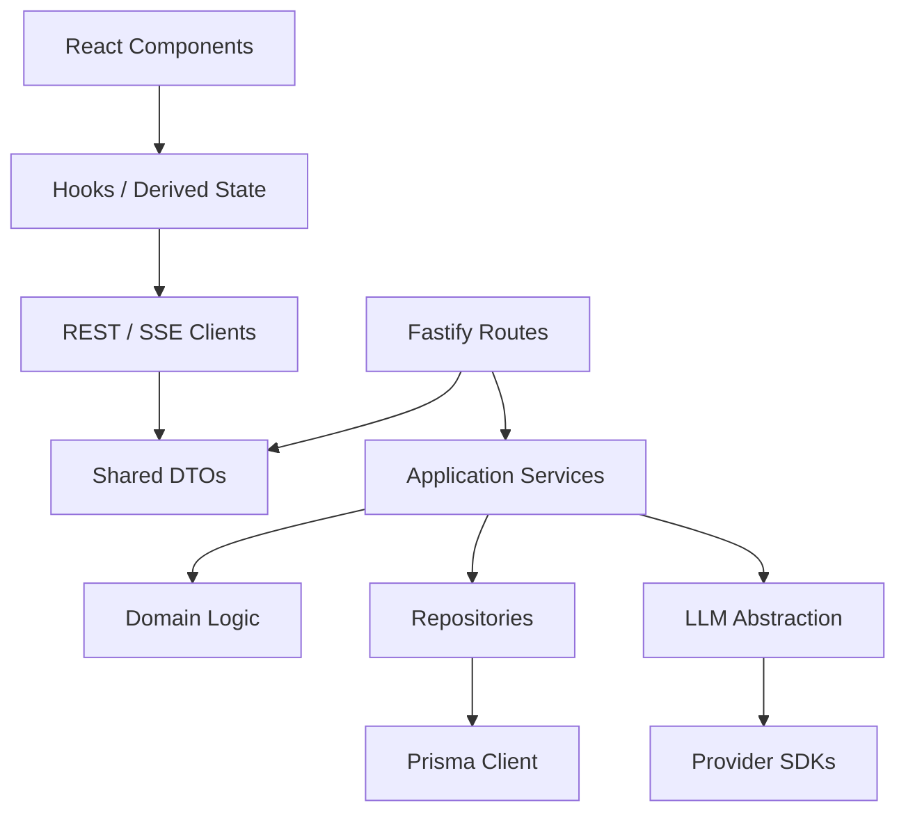
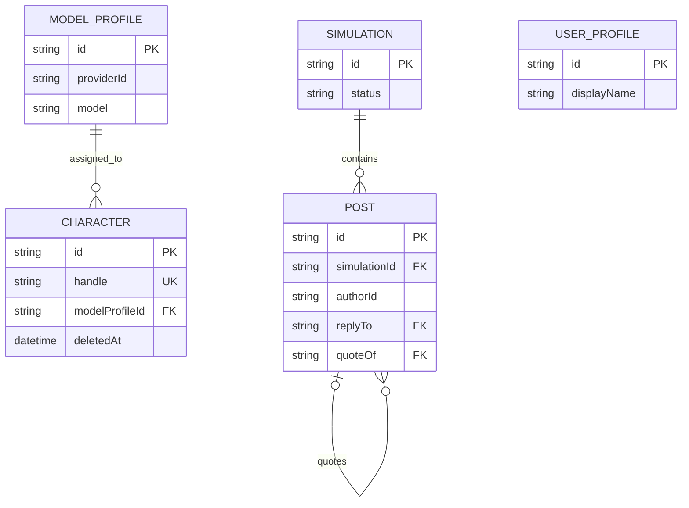
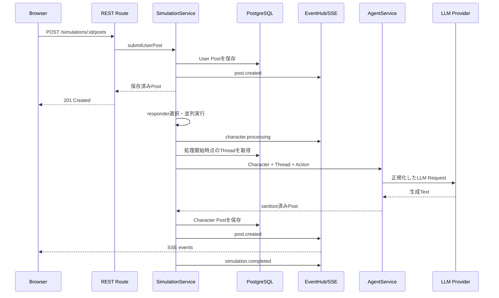

# アーキテクチャ

この文書は、Brickrの現在の実装構造と、変更時に維持すべき境界を説明します。
プロダクト要求の原典は[CLAUDE.md](./CLAUDE.md)、開発参加手順は
[CONTRIBUTE.md](./CONTRIBUTE.md)を参照してください。

## 1. 設計目標

このシステムは、ユーザーのSNS投稿を起点に、異なるPersonaを持つAIキャラクターが
返信、引用、独立投稿を順次生成する様子をリアルタイムに観察するWebアプリケーションです。

設計上の中心は次の5点です。

1. Character PersonaとLLM Providerを分離する
2. ユーザー投稿を即時保存し、LLM処理をHTTPレスポンスから切り離す
3. Character単位の失敗を隔離し、成功した投稿を順次配信する
4. Postを単一モデルとして扱い、ReplyとQuoteを参照関係で表現する
5. APIキーとProvider SDKをBackend境界内に閉じ込める

## 2. システムコンテキスト



BrowserはBackendだけを呼び出します。LLM ProviderへのRequest、API Key、Provider固有形式は
Frontendへ公開しません。PostgreSQLはCharacter、ModelProfile、Simulation、Post、
UserProfileの永続化を担当します。

## 3. Monorepo構成

```text
brickr/
├── apps/
│   ├── backend/
│   │   ├── prisma/              Schemaとidempotent Seed
│   │   └── src/
│   │       ├── agents/          Prompt構築、生成結果のsanitize
│   │       ├── api/             REST/SSE境界とZod検証
│   │       ├── characters/      Character Domainと一括生成
│   │       ├── config/          環境変数の唯一の読取場所
│   │       ├── llm/             Provider抽象化とSDK Adapter
│   │       ├── model-profiles/  CharacterとProvider/Modelの間接参照
│   │       ├── posts/           Post永続化、Mapper、Thread取得
│   │       ├── simulation/      応答選択とオーケストレーション
│   │       └── user-profile/    User Profile
│   └── frontend/
│       └── src/
│           ├── components/      共通表示部品
│           ├── features/        機能単位のComponentと純粋ロジック
│           ├── hooks/           API由来状態
│           ├── services/        REST、SSE、Theme
│           └── types/           Frontend内部状態
├── packages/
│   └── shared/src/              API DTO、SSE Event、共有定数
├── docker-compose.yml
└── CLAUDE.md
```

pnpm workspaceは`apps/*`と`packages/*`を管理します。`@enjo/shared`がNetwork境界の型を提供し、
FrontendとBackendの実装詳細は共有しません。

## 4. 依存方向



主な規則:

- RouteからPrismaを直接呼びません。
- React Componentから`fetch`やProvider SDKを直接呼びません。
- Provider SDKの型を`llm/`外へ出しません。
- `packages/shared`はDTOと定数に限定し、Backend Domain Serviceへ依存しません。
- `apps/backend/src/services.ts`が唯一のComposition Rootです。

## 5. Backendの構成

### 5.1 起動とComposition Root

`server.ts`がFastify Appを構築し、Signal受信時にHTTP ServerとPrisma接続を終了します。
`app.ts`はCORS、Body上限、SecretをRedactするLogger、Route、共通Error Handlerを設定します。

`services.ts`は次の依存を組み立てます。

```text
PrismaClient
  ├─ CharacterRepository ─ CharacterService
  ├─ ModelProfileRepository ─ ModelProfileService
  ├─ PostRepository ─ PostService / ThreadService
  ├─ SimulationRepository ─ SimulationService
  └─ UserProfileRepository ─ UserProfileService

ProviderRegistry ─ LLMClient ─ AgentService
EventHub ─ SimulationService
```

テストではRepository、LLMClient、GeneratorをFakeへ置き換え、外部APIや実DBに依存しない
Service Testを記述できます。

### 5.2 HTTP境界

`api/schemas.ts`がZodでRequestを検証します。Routeは検証後の値だけをServiceへ渡し、
既知のDomain Errorを4xx/5xxのJSON Errorへ変換します。予期しない例外は共通Handlerが
内部情報を隠して`internal_error`として返します。

主要Endpoint:

| Method | Path | 用途 |
| --- | --- | --- |
| `GET` | `/api/health` | Backendと利用可能Providerの確認 |
| `GET` | `/api/characters` | 通常表示用Character一覧 |
| `GET` | `/api/characters/management` | 管理テーブル用Character一覧 |
| `POST` | `/api/characters` | Character作成 |
| `PUT` | `/api/characters/:id` | Character更新 |
| `DELETE` | `/api/characters/:id` | Characterの論理削除 |
| `POST` | `/api/characters/bulk-create` | Character一括生成Job開始 |
| `GET` | `/api/character-bulk-jobs/:id` | 一括生成進捗取得 |
| `POST` | `/api/characters/bulk-delete` | Character一括論理削除 |
| `GET` | `/api/model-profiles` | Provider Model同期と選択肢取得 |
| `GET/PUT` | `/api/user-profile` | User Profile取得・更新 |
| `POST` | `/api/simulations` | Simulation作成 |
| `GET` | `/api/simulations/:id` | SimulationとPost履歴取得 |
| `POST` | `/api/simulations/:id/posts` | User Post作成と生成開始 |
| `GET` | `/api/simulations/:id/events` | Simulation単位のSSE購読 |

### 5.3 永続化モデル



重要な判断:

- `Post.authorId`はCharacterへの外部キーではありません。固定IDのUserとCharacterが同じPostを使うためです。
- Character削除は`deletedAt`による論理削除です。過去Postの投稿者表示を維持します。
- ReplyとQuoteはPostのSelf Relationです。Quote専用テーブルやRepost Entityはありません。
- `quotedPost`はDTO生成時に1階層だけ平坦化します。再帰的な巨大Payloadを防ぎます。
- Avatarと投稿画像は現在Data URLとしてText列へ保存します。

Seedは再実行可能なupsertで、User Profile、ModelProfile、初期Characterを投入します。
Docker Backendは起動時にSchema適用、Prisma Client生成、Seedを実行します。

## 6. 投稿生成フロー



User PostのHTTP RequestはCharacter生成完了を待ちません。保存済みUser Postを返した後、
生成処理はBackend内で継続し、各Postを保存できた時点でSSE配信します。

### 6.1 Responder選択

`responder-selector.ts`は次を組み合わせます。

- MentionされたCharacter
- API互換性のため残る明示`responderIds`
- `activityLevel`と`responseProbability`で重み付けした候補
- `MIN_RESPONDERS`と`MAX_RESPONDERS`の上下限

通常UIではCharacterの明示選択を行わず、Mentionがユーザーの意図を表します。
Cascade時の追加反応では、反応側の`responseProbability`、投稿者の`influence`、現在の深度を使い、
深い会話ほど自然に収束しやすくします。

### 6.2 Action選択

`action-selector.ts`がCharacterの`replyProbability`と`quoteProbability`、対象Post、
Thread状態から`reply`、`quote`、`post`を決めます。選択結果は次の参照へ変換されます。

| Action | `replyTo` | `quoteOf` |
| --- | --- | --- |
| Reply | 対象Post ID | `null` |
| Quote | `null` | 対象Post ID |
| Post | `null` | `null` |

### 6.3 Round/Waveを永続化しない

実装上の`runRound`は、ある対象Postへ反応するCharacter集合を処理し、その結果からcascadeを
再帰的に開始する制御関数です。Domain ModelやDBにRound/Waveは存在しません。

各CharacterはLLM呼び出しの直前に`ThreadService`から現在のThreadを読み直します。
そのため、先に完了したCharacterのPostを、後から処理を開始するCharacterが文脈として読めます。
全員へ同じSnapshotを固定配布するBarrier同期は行いません。

安全上の上限:

- Submissionあたりの生成Post数: 24
- 1 Character Postへのopportunistic cascade: 最大2 Character
- cascade深度: `MAX_CASCADE_DEPTH`
- 同時LLM呼び出し: `MAX_CONCURRENT_CHARACTERS`

`simulation.completed.generatedPostIds`には保存に成功したPost IDだけを蓄積します。

### 6.4 停止と再開

停止時はDBのSimulation statusを`stopped`へ変更し、Process内の停止Setにも記録します。
進行中のLLM Request自体を強制Cancelするのではなく、開始前と保存前に停止状態を確認して
新しいPostの追加を防ぎます。再開時はstatusと停止Setを戻します。

Frontendでは独立した停止ボタンを置かず、SSE接続表示から購読を切断・再接続します。
古い停止済みSimulationを復元した場合は自動的にresumeします。

## 7. LLMアーキテクチャ

### 7.1 CharacterとModelの分離

```text
Character
  └─ modelProfileId
       └─ ModelProfile(providerId, model)
            └─ LLMProviderRegistry
                 └─ OpenAI / Anthropic / Gemini / Mock
```

CharacterはAPI Key、Provider SDK、Model名を直接持ちません。Personaを変えずにModelProfileだけを
差し替えられます。`AgentService`がCharacterのModelProfileを解決し、共通Requestを
`LLMClient`へ渡します。

### 7.2 Provider Interface

Providerは主に次を実装します。

- `available`: APIキーが設定され利用可能か
- `defaultModel`: Provider fallback時のModel
- `listModels`: APIキーで利用可能な生成Model一覧
- `generate`: 共通RequestからProvider固有SDKへの変換

Provider Adapterは次の差を吸収します。

- Message RoleとContent形式
- 画像のbase64/Data URL表現
- token上限パラメータ
- structured output / JSON Schema形式
- AbortSignal
- SDK Error、HTTP status、retryable判定

`LLMClient`はTimeout、上限付きRetry、未設定Providerから利用可能ProviderへのFallback、
空応答の拒否を共通化します。

### 7.3 Model Catalog

`GET /api/model-profiles`の最初の呼び出しで、設定済みProviderのModels APIを並列に呼びます。
成功したモデルはProvider/Modelの組から作る安定したHash IDでModelProfileへupsertし、
結果を5分間Cacheします。

- Anthropic: Models APIの返却Model
- Gemini: `generateContent`対応Modelだけ
- OpenAI: Models APIにendpoint capabilityがないため、会話Model familyから専用Modelを除外
- Mock: `mock` Model

一つのProviderが失敗しても`Promise.allSettled`で他Providerの結果を保存します。失敗理由は
Secretを含めずBackend Logへ記録し、保存済みProfileを選択肢として維持します。

### 7.4 Promptと画像

`prompt-builder.ts`はPersona固有部分と全Character共通ルールを分離してSystem Promptを作ります。
Threadはhandle、Reply/Quote関係、投稿本文を含むTranscriptへ変換します。

通常User Postだけが1枚の画像を持てます。画像はAPI境界でMIME、base64形式、5MiB上限を検証し、
Data URLとして保存します。LLMへ渡す際にData URLを解析し、各ProviderのMultimodal形式へ変換します。
ReplyとQuoteへの新規画像添付はSchemaで拒否します。

### 7.5 Character一括生成

一括生成は1〜100人を受け付け、Backend Process内の非同期Jobとして動きます。

1. 最大5人ずつのBatchへ分割
2. 最大3 Batchを並列生成
3. 人数に一致する固定キーJSON SchemaをProviderへ渡す
4. JSON parse後にZodで項目と件数を再検証
5. 行動傾向をBackendでランダム生成
6. 一括保存してJobをcompletedへ更新

Job状態は`generating`、`saving`、`completed`、`failed`です。JobはProcess Memoryにあり、
Backend再起動で失われます。最大100 Jobを保持します。

## 8. SSEと整合性

`EventHub`はSimulation IDごとのProcess内Pub/Subです。SSE Routeは購読をHTTP Streamへ変換し、
20秒ごとのHeartbeatと3秒の再接続指示を送ります。

Event:

| Event | 意味 |
| --- | --- |
| `post.created` | Postが保存されDTO化された |
| `character.processing` | Characterが対象Postの処理を開始した |
| `character.skipped` | Characterが投稿しなかった |
| `character.failed` | Character単位の期待される失敗 |
| `simulation.completed` | Triggerに対する生成処理が完了した |
| `simulation.failed` | Run全体が継続できなかった |

FrontendはSSEを開始してからRESTで履歴を取得します。これにより履歴取得中に生成されたPostを
取りこぼしません。ReducerはPost IDでREST結果とSSE Eventをmergeし、重複を除去します。
EventSource標準の自動再接続を利用し、独自の無制限Retry Loopは持ちません。

EventHubは単一Process前提です。Backendを水平分割する場合は、Redis Pub/Subなど共有Event Busと、
Job/停止状態の共有Storeが必要です。

## 9. Frontendアーキテクチャ

### 9.1 Bootstrap

`App.tsx`はUser ProfileとCharacter一覧を取得し、`localStorage`のSimulation IDを復元します。
保存済みSimulationがなければ新規作成します。Theme選択もBrowserへ保存します。

`SimulationView.tsx`が次のView状態を管理します。

- Home
- Character Timeline
- Character管理テーブル
- Post詳細
- Character/User編集Modal

独立したRouter Libraryは使わず、現在はComponent Stateによる画面遷移です。URL Deep Linkや
Browser Back連携が必要になった場合はRouter導入を検討します。

### 9.2 Network境界

- `api-client.ts`: REST、JSON Error、Abort、Backend URL
- `sse-client.ts`: EventSource、named event、購読解除
- `useSimulationEvents.ts`: REST hydrationとSSEをReducerへ統合
- `useCharacters.ts` / `useUserProfile.ts`: Resource取得と更新

ComponentはNetwork Protocolを知りません。

### 9.3 Timelineの派生状態

FrontendはSimulation内の全Postを保持し、`thread-utils.ts`の純粋関数で表示を作ります。

- User Timeline: UserのThread Starterと`@you` Mention
- Character Timeline: 本人のPostと本人へのMention
- Reply Index: `replyTo`ごとの直接返信
- Reply展開: Cycle-safeな探索で全子孫を平坦化
- Repost Index: `quoteOf`ごとの直接引用
- Post詳細: 対象Post、全Reply子孫、直接Repost、参照元1件

Thread専用APIやFrontend専用Thread Storeはありません。REST/SSEで得た`PostDto[]`がSource of Truthです。

### 9.4 表示とTheme

色は`index.css`のSemantic Tokenで定義し、8種類のThemeが同じComponentへ値を提供します。
Bootstrap Iconsは`Icon.tsx`で名前を型付けします。AvatarはBrowser側Canvasで正方形へCropし、
正規化したData URLだけをBackendへ送信します。

Timelineと右Character Panelは100件ずつ追加表示し、Character管理テーブルは100件ごとの
Paginationを使用します。管理テーブルのHeaderはScroll領域内で固定されます。

## 10. エラーと回復

エラーは影響範囲で扱いを分けます。

- 入力不正: Zodで400
- Resource不存在: Domain Errorを404
- Handle競合: 409
- Character単位のLLM失敗: Logと`character.failed`、他Characterは継続
- Model Catalogの一部失敗: 成功Providerと保存済みProfileを継続
- Run全体の予期しない失敗: `simulation.failed`
- REST Network Error: FrontendのErrorBannerと再試行
- SSE切断: 再接続中表示、EventSourceが自動再接続

LLM Retryは`LLM_MAX_RETRIES`で上限を持ち、Timeoutは`LLM_TIMEOUT_MS`でAbortします。
無制限Retryや、全Character成功を前提にしたTransactionは使用しません。

## 11. セキュリティ境界

- `.env`とAPIキーはGit管理外です。
- APIキーはBackendだけが読み、DTO、SSE、Frontend Bundleへ含めません。
- Authorization/Cookie HeaderはBackend LoggerでRedactします。
- Request BodyはZodで型、長さ、画像形式、画像サイズを検証します。
- 投稿本文はReact Elementとして分割表示し、HTMLとして注入しません。
- Persona Promptと行動確率は専用Config/Management API以外へ返しません。
- CORS Originは`CORS_ORIGIN`で制限します。

現在、利用者認証、認可、CSRF保護、Rate Limit、Object Storage、Content Moderationはありません。
したがって、現状のDocker構成をそのまま信頼できないネットワークへ公開する設計ではありません。

## 12. テスト戦略

Vitestを使用し、外部APIやNetworkに依存しない高速なテストを中心にします。

- Selection/Action/Concurrency: Simulation純粋ロジック
- SimulationService: Event、部分失敗、停止、cascade、生成ID
- Prompt/Mapper/Sanitize: Providerへ渡す境界形式
- CharacterService/Generator: CRUD、一括生成、structured output、失敗理由
- API Schema: 入力制限と画像検証
- Thread helpers: Reply/Repostの順序、平坦化、cycle
- Frontend utilities: URL、Mention、Avatar crop、Theme

実Provider APIは通常のTest Suiteでは呼びません。SDK Contractは型検査とMapper Testで守り、
必要に応じてSecretをCommitしない手動Smoke Testを行います。

## 13. 現在の制約と拡張ポイント

| 制約 | 現在の理由 | 拡張時の候補 |
| --- | --- | --- |
| Backend単一Process | EventHub、Job、停止SetがMemory内 | Redis、Queue、共有Job Store |
| Data URL画像 | MVPでStorageを単純化 | Object Storage、署名URL、Thumbnail |
| Component State遷移 | 画面数が少ない | Router、URL Deep Link |
| `prisma db push` | 開発優先 | Versioned Migration |
| 認証なし | 単一利用者の開発用途 | Authentication、Ownership、RBAC |
| Model Catalog 5分Cache | Provider API負荷抑制 | 明示Refresh、永続Status、Capability metadata |
| Bulk JobはMemory内 | 小規模な非同期処理 | Durable Queue、Worker、再開 |

拡張時も、まず既存の境界内で小さく実装できるかを確認してください。将来の可能性だけを理由に
新しいInfrastructureや抽象化を追加しないことが、このプロジェクトの基本方針です。
